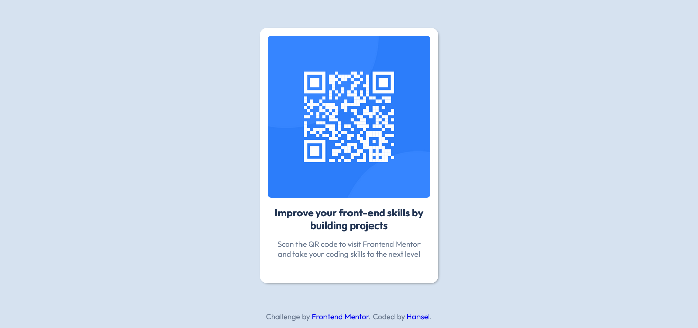

# Frontend Mentor - QR code component solution

This is a solution to the [QR code component challenge on Frontend Mentor](https://www.frontendmentor.io/challenges/qr-code-component-iux_sIO_H). Frontend Mentor challenges help you improve your coding skills by building realistic projects. 

## Table of contents

- [Frontend Mentor - QR code component solution](#frontend-mentor---qr-code-component-solution)
  - [Table of contents](#table-of-contents)
    - [Screenshot](#screenshot)
  - [My process](#my-process)
    - [Built with](#built-with)
    - [What I learned](#what-i-learned)
    - [Continued development](#continued-development)
  - [Author](#author)

### Screenshot




## My process

### Built with

- Semantic HTML5 markup
- CSS custom properties
- Flexbox
- CSS Grid
- Mobile-first workflow


### What I learned

In this project, I learnt how to make my components responsive; that is the QR Code container and also applied some utility classes. Not much else was learned besides that.

To see how you can add code snippets, see below:

```html
<span class="nowrap">front-end</span>
```
```css
.card {
  height: auto;
}
```


### Continued development

I plan to continue building more layouts with flex and grid and applying responsive design principles


## Author

- GitHub - [Chidubem Chibuzo](https://github.com/Hanseldev)
- Frontend Mentor - [@Hanseldev](https://www.frontendmentor.io/profile/Hanseldev)
- X - [@ChidubemCh919](https://www.twitter.com/chidubemch919)
